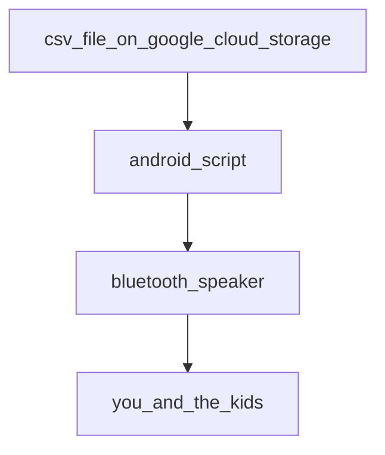

# Ý tưởng lớn
Để học giỏi tiếng Anh và các ngôn ngữ tiếng nước ngoài, bạn phải kết hợp nhiều phương pháp khác nhau. Nghiên cứu chỉ ra rằng phương pháp nghe thụ động hàng ngày có tác dụng kích thích não bộ của con người một cách hiệu quả, từ đó giúp bạn dễ dàng học được các ngôn ngữ. Passio là một công cụ được xây dựng để "tắm" cả gia đình bạn với hơn 1000 từ, trong cả 4 ngôn ngữ tiếng Việt, tiếng Anh, tiếng Tây Ban Nha và tiếng Hoa phổ thông hàng ngày, giúp tạo tiền đề tốt để bạn dễ dàng học các ngôn ngữ này về sau. Khi được cài vào 1 chiếc điện thoại Android đã được root (chi phí đầu tư khoảng 2tr), kết nối với loa Bluetooth (chi phí đầu tư khoảng 500k), mỗi buổi sáng, ứng dụng sẽ hoạt động như 1 cái loa phát thanh nhắc đi nhắc lại 1 trong số 1000 từ thông dụng nhất trong cả 4 thứ tiếng kèm các câu ví dụ trong khoảng 1 giờ đồng hồ, khi bạn và các bạn nhỏ đang chuẩn bị cho ngày mới. Hoặc có thể là vào buổi tối. Phần mềm sẽ tự động chạy không cần con người phải can thiệp, do đó bạn chỉ cần cài đặt 1 lần duy nhất và cứ thế nhận lợi ích từ việc học ngôn ngữ thụ động hàng ngày.

# Cài đặt
1. Chuẩn bị 1 thiết bị android đã được root
2. Đảm bảo rằng `abd shell` có thể chạy và kiểm soát thiết bị của bạn
3. Download và cài termux
```
curl -O -L https://github.com/passivon/passivon/raw/main/termux96.apk
adb install -r termux96.apk
```
4. Bật termux
5. Chạy lệnh sau trên termux:
```
  wget -qO- https://raw.githubusercontent.com/passivon/passivon/main/install.sh | bash
```

Nếu bạn đang dùng adb shell, bạn có thể chạy lệnh sau để từ máy tính gửi lệnh lên termux
```
adb shell input text "wget%s-qO-%s"
adb shell input text "https://raw.githubusercontent.com/passivon/passivon/main/install.sh"
adb shell input text "%s\|%sbash"
adb shell input keyevent 66

```

# Lộ trình kĩ thuật
## Giai đoạn 1 - giai đoạn hiện tại
Giai đoạn này chỉ dành cho những lập trình viên hoặc có năng lực IT đặc biệt, bạn sẽ phải tự root điện thoại Android của mình, đấu nối điện thoại của bạn với nguồn điện, kết nối điện thoại với 1 chiếc loa bluetooth.

## Giai đoạn 2 - dự kiến bắt đầu vào Q1 2023
Giai đoạn này dành cho những người có một chút ít kĩ năng IT cơ bản, bạn sẽ phải tự root điện thoại android của mình, nhưng bạn sẽ được hướng dẫn cách chọn dòng điện thoại phù hợp sẵn có trên thị trường và cách root có thể tự thao tác được hoặc thông qua một nhóm các thợ root có thể tìm thấy qua 1 kênh Telegram do chúng tôi tạo ra. Chúng tôi cũng sẽ quy định là việc root là miễn phí, nhưng sau khi root xong bạn có thể gửi 1 khoản bồi dưỡng tuỳ tâm cho thợ root. Nguyên tắc là sẽ không có ai mất tiền, thợ root không nhất thiết kiếm được tiền.

## Giai đoạn 3 - dự kiến bắt đầu vào Q3 2023
Giai đoạn này dành cho hầu hết mọi người, chúng tôi sẽ thay đổi phần mềm để nó chạy không cần root, hoạt động cho cả iPhone lẫn Android

# Lộ trình nội dung
## Giai đoạn 1
Nội dung được sinh ra bởi Google Dịch và từ điển cambridge

## Giai đoạn 2
Biên tập nội dung dựa vào cộng đồng những người sành sỏi các ngôn ngữ

# Sơ đồ

## Cách hoạt động


## Cách lắp đặt
1. Bạn mua 1 chiếc điện thoại có thể root được, ví dụ Samsung Note9
2. Root chiếc điện thoại của bạn
3. Cài đặt termux
4. Chạy script để cài passivon agent vào điện thoại của bạn
5. Kết nối với load bluetooth để hàng ngày nó "tắm" bạn và gia đình với 1 từ tiếng Anh mới

Hiện tại mã ứng dụng sẽ phát thanh vào 6:30 đến 7:30 hàng ngày. Bạn có
thể đổi múi giờ để "hack" nó thành giờ phù hợp với bạn.

# Đóng góp
Đây là 1 sản phẩm open source với mục đích giúp người Việt Nam và xa hơn là các nước học tiếng Anh và các ngôn ngữ phổ biến đó một cách thụ động, qua đó tạo ra nhiều công dân toàn cầu hơn trong tương lai. Chúng tôi chào đón mọi sự đóng góp, đặc biệt là sự đóng góp về mã nguồn và nội dung. Để đóng góp, bạn hãy fork repo này, sau đó sửa và gửi pull request.

# Telegram
Tham gia chat chit về dự án trên Telegram ở đây: https://t.me/+AIsBnziM8rU0ZjQ1
