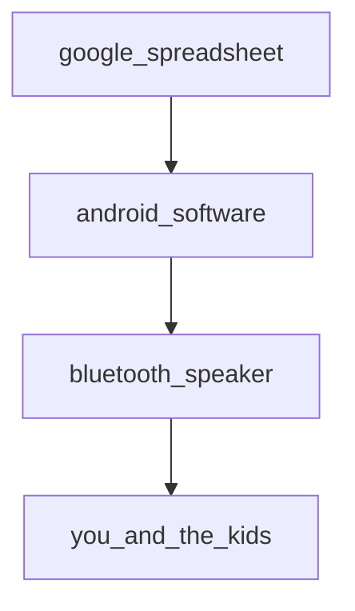

# Ý tưởng lớn
Giúp bạn và gia đình đơn giản để học khoảng 1000 từ tiếng Anh trong khoảng 3 năm
Mỗi buổi sáng, sẽ có 1 cái loa phát thanh nhắc đi nhắc lại 1 trong số 1000 từ thông dụng nhất trong tiếng Anh trong khoảng 1 giờ đồng hồ, khi bạn và các bạn nhỏ đang chuẩn bị cho ngày mới. Hoặc có thể là vào buổi tối. Phần mềm sẽ tự động chạy không cần con người phải can thiệp.

# Lộ trình kĩ thuật
## Giai đoạn 1
Giai đoạn này chỉ dành cho những lập trình viên hoặc có năng lực IT đặc biệt, bạn sẽ phải tự root điện thoại Android của mình, đấu nối điện thoại của bạn với nguồn điện, kết nối điện thoại với 1 chiếc loa bluetooth.

## Giai đoạn 2
Giai đoạn này dành cho những người có một chút ít kĩ năng IT cơ bản, bạn sẽ phải tự root điện thoại android của mình, nhưng bạn sẽ được hướng dẫn cách chọn dòng điện thoại phù hợp sẵn có trên thị trường và cách root có thể tự thao tác được hoặc thông qua một nhóm các thợ root có thể tìm thấy qua 1 kênh Telegram do chúng tôi tạo ra. Chúng tôi cũng sẽ quy định là việc root là miễn phí, bạn chỉ cần trả tiền sau khi root xong. Nguyên tắc là sẽ không có ai mất tiền, thợ root không nhất thiết kiếm được tiền.

## Giai đoạn 3
Giai đoạn này dành cho hầu hết mọi người, chúng tôi sẽ thay đổi phần mềm để nó chạy không cần root, hoạt động cho cả iPhone lẫn Android 

# Lộ trình nội dung
## Giai đoạn 1
Sẽ chỉ có tiếng Anh và tiếng Việt

## Giai đoạn 2
Bổ sung tiếng Tây Ban Nha

## Giai đoạn 3
Bổ sung tiếng Trung Phổ Thông (tiếng Bắc Kinh)

## Giai đoạn 4
Cho phép bạn lựa chọn danh sách các ngôn ngữ mà bạn muốn học

# Sơ đồ

## Cách hoạt động

## Cách lắp đặt
1. Bạn mua 1 chiếc điện thoại có thể root được, ví dụ Note9
2. Root chiếc điện thoại của bạn
3. Cài đặt termux
4. Chạy script để cài passive-english agent vào điện thoại của bạn
5. Kết nối với load bluetooth để hàng ngày nó "tắm" bạn và gia đình với 1 từ tiếng Anh mới

# Đóng góp
Đây là 1 sản phẩm open source với mục đích giúp người Việt Nam và xa hơn là các nước học tiếng Anh và các ngôn ngữ phổ biến đó một cách thụ động, qua đó tạo ra nhiều công dân toàn cầu hơn trong tương lai. Chúng tôi chào đón mọi sự đóng góp, đặc biệt là sự đóng góp về mã nguồn và nội dung. Để đóng góp, bạn hãy fork repo này, sau đó sửa và gửi pull request.

Các ưu tiên cần hiện nay:
1. Tạo ra one-liner installation, giả định rằng user đã root được máy và cài sẵn termux
2. Cho phép user có thể cá nhân hoá giờ phát thanh của họ
