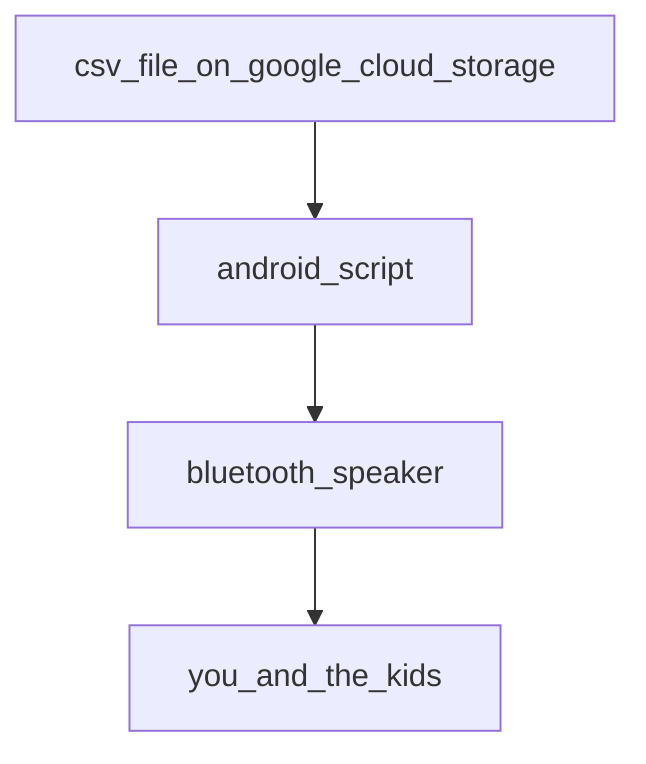

# Ý tưởng lớn
Để học giỏi tiếng Anh và các ngôn ngữ tiếng nước ngoài, cần phải kết hợp nhiều phương pháp khác nhau. Nghiên cứu chỉ ra rằng phương pháp nghe thụ động hàng ngày có tác dụng kích thích não bộ của trẻ em một cách hiệu quả, từ đó giúp các em dễ dàng học được các ngôn ngữ. Passivon là một công cụ được xây dựng để "tắm" các em với hơn 1000 từ, trong cả 4 ngôn ngữ tiếng Việt, tiếng Anh, tiếng Tây Ban Nha và tiếng Hoa phổ thông hàng ngày, giúp tạo tiền đề tốt để các em dễ dàng học các ngôn ngữ này về sau. Khi được cài vào 1 chiếc điện thoại Android đã được root (chi phí đầu tư khoảng 2tr), kết nối với loa Bluetooth (chi phí đầu tư khoảng 500k), mỗi buổi sáng, ứng dụng sẽ hoạt động như 1 cái loa phát thanh nhắc đi nhắc lại 1 trong số 1000 từ thông dụng nhất trong cả 4 thứ tiếng kèm các câu ví dụ trong khoảng 1 giờ đồng hồ từ 6:30 - 7:30, khi bạn và các bạn nhỏ đang chuẩn bị cho ngày mới. Phần mềm sẽ tự động chạy không cần con người phải can thiệp, do đó bạn chỉ cần cài đặt 1 lần duy nhất và cứ thế nhận lợi ích từ việc học ngôn ngữ thụ động hàng ngày.

# Lộ trình kĩ thuật
## Giai đoạn 1 - giai đoạn hiện tại
Giai đoạn này bạn cần phải sử dụng một chiếc Android đã được root (có thể mua Note9 rồi nhờ cửa hàng điện thoại root giùm), sau đó kết nối thêm với loa Bluetooth để cho âm thanh đủ to. Chú ý bạn phải cắm điện liên tục cho điện thoại và loa.

## Giai đoạn 2 - dự kiến bắt đầu vào Q4 2025
Giai đoạn này chúng tôi sẽ thay đổi phần mềm để nó chạy không cần root, hoạt động cho cả iPhone lẫn Android

# Lộ trình nội dung
## Giai đoạn 1 - giai đoạn hiện tại
Nội dung được sinh ra bởi Google Dịch và từ điển cambridge

## Giai đoạn 2 - chờ cao nhân tiếng Anh, tiếng Tây Ban Nha, tiếng Hoa xuất hiện
Biên tập nội dung dựa vào cộng đồng những người sành sỏi các ngôn ngữ

# Sơ đồ

## Cách hoạt động


# Cách lắp đặt
## 1. Mua điện thoại và root
1.1. Bạn mua 1 chiếc điện thoại có thể root được, ví dụ Samsung Note9.
   Chú ý rằng để root đơn giản, bạn cần lựa chọn các dòng Android phù hợp, vì
   có những dòng Android rất khó root. Bạn có thể liên hệ
   [suachuaphanmem.vn](https://suachuaphanmem.vn/shop/dich-vu-up-rom-android/)
   để được tư vấn hoặc tìm kiếm trên google với từ khoá "chuyên root
   android"

1.2. Root chiếc điện thoại của bạn - nhờ cửa hàng điện thoại hoặc tự làm
   theo hướng dẫn trên mạng

## 2. Cài đặt
2.1. Chuẩn bị 1 thiết bị android đã được root, cắm cáp nối với máy tính
2.2. Cài đặt adb - tham khảo hướng dẫn trên google
2.3. Đảm bảo rằng `abd shell` có thể chạy và kiểm soát thiết bị của bạn
2.4. Download và cài termux
```
curl -O -L https://github.com/passivon/passivon/raw/main/termux96.apk
adb install -r termux96.apk
```
2.5. Bật ứng dụng termux trên màn hình android
2.6. Chạy lệnh sau trên termux:
```
  wget -qO- https://raw.githubusercontent.com/passivon/passivon/main/install.sh | bash
```

Nếu bạn đang dùng adb shell, bạn có thể chạy lệnh sau để từ máy tính gửi lệnh lên termux
```
adb shell input text "wget%s-qO-%s"
adb shell input text "https://raw.githubusercontent.com/passivon/passivon/main/install.sh"
adb shell input text "%s\|%sbash"
adb shell input keyevent 66

```
## 3. Kết nối với loa
Mua thêm củ loa (ví dụ loa bluetooth) và kết nối với điện thoại để tiếng
phát thanh được đủ to

## 4. Tinh chỉnh
Hiện tại mã ứng dụng sẽ phát thanh vào 6:30 đến 7:30 hàng ngày. Bạn có
thể đổi múi giờ cuả điện thoại để "hack" nó thành giờ phù hợp với bạn.

# Đóng góp
Đây là 1 sản phẩm open source với mục đích giúp người Việt Nam và xa hơn là các nước học tiếng Anh và các ngôn ngữ phổ biến đó một cách thụ động, qua đó tạo ra nhiều công dân toàn cầu hơn trong tương lai. Chúng tôi chào đón mọi sự đóng góp, đặc biệt là sự đóng góp về mã nguồn và nội dung. Để đóng góp, bạn hãy fork repo này, sau đó sửa và gửi pull request.

# Telegram
Tham gia chat chit về dự án trên Telegram ở đây: https://t.me/+AIsBnziM8rU0ZjQ1
